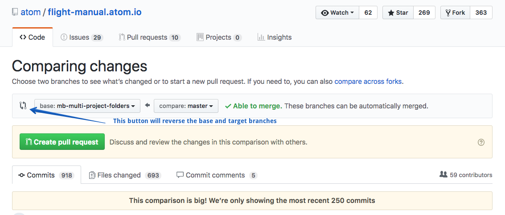

# GitHub Branch Compare Reversal extension

This chrome-extension reverses the target and base branch upon clicking on the pull request icon. Normally this icon is not _clickable_:

## Installation

Simply install the extension directly from the Chrome Store: https://chrome.google.com/webstore/detail/bbnegdfkgopjcfbjhdghddebffjfghon

## Limitations

There's a few things to take into consideration:

* This currently only works on GitHub.com
* It's not a lot of work making it work on GitHub Enterprise, so open an issue if you have that requirement.
* The DOM on this page is very generic so the jQuery selections can be a bit fragile. If there are issues [open a new issue](https://github.com/bitoiu/github-compare-branch-reverse/issues/new).
* This extension only works for branches in the same repository

## Contributing

Pull requests are welcome as well as issues reporting problems or providing feedback.

The extension is extremely simple and as such it doesn't include a package manager and/or build tool. To develop the extension simply clone the repository and load the unpacked extensions directly into Google Chrome.

:octocat::heart:
